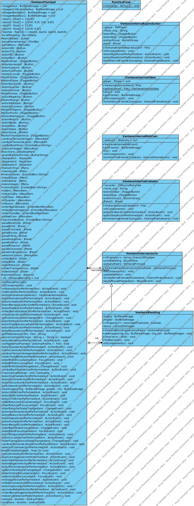
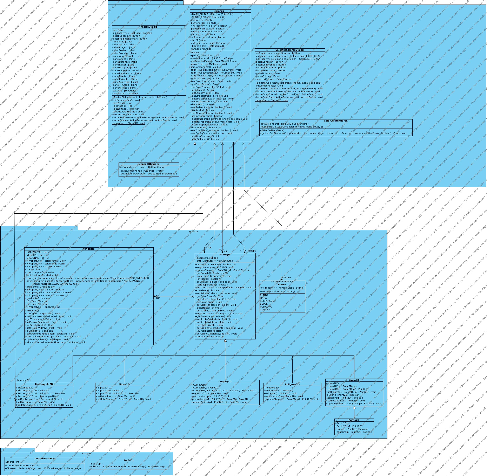
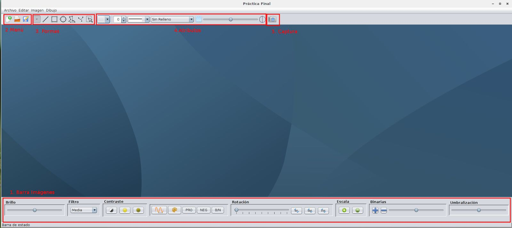

# Documentación

1. Descripción general

2. Requisitos específicos

2.1 Requisitos de interfaz de usuario.

2.2 Requisitos funcionales

2.2.1 Requisito funcional 1

2.2.2 Requisito funcional 2

2.2.3 Requisito funcional 3

2.2.4 Requisito funcional 4

2.2.5 Requisito funcional 5

2.2.6 Requisito funcional 6

2.2.7 Requisito funcional 7

2.2.8 Requisito funcional 8

2.2.9 Requisito funcional 9

2.2.10 Requisito funcional 10

2.2.11 Requisito funcional 11

2.2.12 Requisito funcional 12

2.2.13 Requisito funcional 13

2.2.14 Requisito funcional 14

2.2.15 Requisito funcional 15

2.2.16 Requisito funcional 16

2.2.17 Requisito funcional 17

2.2.18 Requisito funcional 18

2.2.19 Requisito funcional 19

2.2.20 Requisito funcional 20

3. Descripción de la solución

4. Uso de la aplicación

4.1 Barra de imágenes (1)

4.2 Menú (2)

4.3 Formas (3)

4.4 Atributos (4)

4.5 Captura (5)

4.6 Barra superior

## 1. Descripción general

El trabajo realizado para la práctica de la asignatura de sistemas multimedia consiste en una aplicación que dispone de varias funciones que se dividen en tres &quot;grupos&quot;, dibujo, imagen y multimedia.

El apartado de dibujo permite realizar dibujos de figuras simples y modificar sus características, como grosor, discontinuidad, color transparencia, relleno, etc, en el apartado de imágenes tenemos la posibilidad de aplicar diferentes filtros sobre las imagenes, operaciones binarias y la posibilidad de dibujar sobre las imágenes, finalmente en el apartado multimedia nos encontramos con las características relacionadas con el audio y el video, concretamente nos encontramos las siguientes funcionalidades: grabar y reproducir audio, reproducir vídeo, usar la WebCam y la posibilidad de tomar capturas del video y de la WebCam.

## 2. Requisitos específicos

### 2.1 Requisitos de interfaz de usuario.

La interfaz de usuario consiste en un entorno multiventana en el que se distinguirán, al menos, los siguientes tipos de ventana: Ventanas de imágenes, Ventanas de reproducción de sonido, Ventanas de reproducción de vídeo, Ventanas de grabación de audio y Ventana webcam. Además, la aplicación contará con un menú y las siguientes barras de herramientas: Barra de carácter general (nuevo, abrir, guardar, etc.), barra de dibujo para formas y atributos, barra de operaciones sobre imágenes y una barra de audio/video

### 2.2 Requisitos funcionales

#### 2.2.1 Requisito funcional 1

| Número de requisito | RF 1 |
| --- | --- |
| Nombre de requisito | Nuevo |
| Tipo | Requisito |
| Prioridad del requisito | Esencial |
| El botón nuevo crea una nueva ventana con una imagen a la cual se le puede cambiar el tamaño, mediante la opción Dibujo-&gt; Cambiar tamaño lienzo ( RF 2) |

#### 2.2.2 Requisito funcional 2

| Número de requisito | RF 2 |
| --- | --- |
| Nombre de requisito | Cambiar tamaño lienzo |
| Tipo | Requisito |
| Prioridad del requisito | Esencial |
| La opción del menú dibujo &quot;Cambiar tamaño lienzo&quot; lanzará un diálogo que permitirá modificar el tamaño del lienzo de dibujo. |

#### 2.2.3 Requisito funcional 3

| Número de requisito | RF 3 |
| --- | --- |
| Nombre de requisito | Abrir |
| Tipo | Requisito |
| Prioridad del requisito | Esencial |
| El botón abrir permitirá abrir todos los tipos de archivos soportados, para ello lanzará una ventana interna del tipo correspondiente o una alerta en caso de que no se pueda abrir el archivo. |

#### 2.2.4 Requisito funcional 4

| Número de requisito | RF 4 |
| --- | --- |
| Nombre de requisito | Guardar |
| Tipo | Requisito |
| Prioridad del requisito | Esencial |
| El botón guardar permite guardar la imagen de la ventana seleccionada en los diferentes formatos de imagen soportados. |

#### 2.2.5 Requisito funcional 5

| Número de requisito | RF 5 |
| --- | --- |
| Nombre de requisito | Dibujar formas |
| Tipo | Requisito |
| Prioridad del requisito | Esencial |
| La aplicación debe disponer de botones para dibujar las siguientes formas:
- Punto
- Línea recta
- Rectángulo
- Elipse
- Polígono
- Curva con un punto de control
 |

#### 2.2.6 Requisito funcional 6

| Número de requisito | RF 6 |
| --- | --- |
| Nombre de requisito | Atributo Color |
| Tipo | Requisito |
| Prioridad del requisito | Esencial |
| Se dispone de la opción para seleccionar el color del trazo y del relleno de las figuras dibujadas. |

#### 2.2.7 Requisito funcional 7

| Número de requisito | RF 7 |
| --- | --- |
| Nombre de requisito | Atributo Trazo |
| Tipo | Requisito |
| Prioridad del requisito | Esencial |
| Se dispone de múltiples opciones de discontinuidad en el trazo, entre las que se incluyen líneas continuas y punteadas. |

#### 2.2.8 Requisito funcional 8

| Número de requisito | RF 8 |
| --- | --- |
| Nombre de requisito | Atributo Relleno |
| Tipo | Requisito |
| Prioridad del requisito | Esencial |
| Se permite rellenar las figuras dibujadas usando un color sólido, un degradado vertical, un degradado horizontal o un degradado diagonal. |

#### 2.2.9 Requisito funcional 9

| Número de requisito | RF 9 |
| --- | --- |
| Nombre de requisito | Atributo Alisado de bordes |
| Tipo | Requisito |
| Prioridad del requisito | Esencial |
| Se da la posibilidad de alisar los bordes de las figuras dibujadas. |

#### 2.2.10 Requisito funcional 10

| Número de requisito | RF 10 |
| --- | --- |
| Nombre de requisito | Atributo Transparencia |
| Tipo | Requisito |
| Prioridad del requisito | Esencial |
| Se permite activar y desactivar la transparencia de las figuras, ademas de permite modificar el nivel de transparencia mediante un deslizador. |

#### 2.2.11 Requisito funcional 11

| Número de requisito | RF 11 |
| --- | --- |
| Nombre de requisito | Mantener figuras en el lienzo |
| Tipo | Requisito |
| Prioridad del requisito | Esencial |
| El lienzo debe mantener todas las figuras que el usuario haya dibujado. |

#### 2.2.12 Requisito funcional 12

| Número de requisito | RF 12 |
| --- | --- |
| Nombre de requisito | Atributos figuras |
| Tipo | Requisito |
| Prioridad del requisito | Esencial |
| Cada figura puede tener sus atributos propios independientes de las demás. |

#### 2.2.13 Requisito funcional 13

| Número de requisito | RF 13 |
| --- | --- |
| Nombre de requisito | Boundingbox figura seleccionada |
| Tipo | Requisito |
| Prioridad del requisito | Esencial |
| Cuando el botón de selección esté activado y se haga click sobre una figura, debe aparecer una rectángulo que circunscriba a la figura seleccionado. |

#### 2.2.14 Requisito funcional 14

| Número de requisito | RF 14 |
| --- | --- |
| Nombre de requisito | Editar atributos figura |
| Tipo | Requisito |
| Prioridad del requisito | Esencial |
| Se permite modificar los atributos de la figura seleccionada. |

#### 2.2.15 Requisito funcional 15

| Número de requisito | RF 15 |
| --- | --- |
| Nombre de requisito | Mover figura |
| Tipo | Requisito |
| Prioridad del requisito | Esencial |
| Se permite mover la figura seleccionado por el lienzo. |

#### 2.2.16 Requisito funcional 16

| Número de requisito | RF 16 |
| --- | --- |
| Nombre de requisito | Operaciones sobre imagenes |
| Tipo | Requisito |
| Prioridad del requisito | Esencial |
| Se debe disponer de las siguientes operaciones sobre las imagenes:
- Duplicar, que creará una nueva &quot;ventana imagen&quot; con una copia de la imagen
- Modificar el brillo mediante un deslizador
- Filtros de emborronamiento, enfoque y relieve
- Contraste normal, iluminado y oscurecido
- Negativo (invertir colores)
- Transformación a niveles de gris
- Giro libre mediante deslizador
- Escalado (aumentar y disminuir)
- Sepia
- Suma y resta de imágenes
- Mezcla de imágenes mediante deslizador
- Umbralización con deslizador para modificar umbral
- Una nueva operación de diseño propio
 |

#### 2.2.17 Requisito funcional 17

| Número de requisito | RF 17 |
| --- | --- |
| Nombre de requisito | Capturar |
| Tipo | Requisito |
| Prioridad del requisito | Esencial |
| Se permite hacer capturas de los videos de los videos y la WebCam. |

#### 2.2.18 Requisito funcional 18

| Número de requisito | RF 18 |
| --- | --- |
| Nombre de requisito | Reproducir y grabar audio |
| Tipo | Requisito |
| Prioridad del requisito | Esencial |
| El sistema permitirá grabar y reproducir audio. |

#### 2.2.19 Requisito funcional 19

| Número de requisito | RF 19 |
| --- | --- |
| Nombre de requisito | Reproducir vídeo |
| Tipo | Requisito |
| Prioridad del requisito | Esencial |
| El programa dispondrá de una funcionalidad para reproducir video. |

#### 2.2.20 Requisito funcional 20

| Número de requisito | RF 20 |
| --- | --- |
| Nombre de requisito | WebCam |
| Tipo | Requisito |
| Prioridad del requisito | Opcional |
| La aplicación tendrá la posibilidad de mostrar las imágenes captadas por la WebCam. |

## 3. Descripción de la solución

Para satisfacer los requisitos se ha realizado una aplicación que consta de una ventana principal en la que se localizan todos los botones y menús. Además de esta ventana existen otros tipos de ventana:

VentanaInternaLienzo: Esta ventana contiene un objeto de tipo Liento2DImagen por lo cual permite mostrar imágenes y realizar dibujos con las características especificadas en los requisitos funcionales.

VentanBlending: Es un tipo de ventana que se genera con la mezcla de dos imágenes y permite variar el peso de cada imagen en la mezcla.

VentanaInternaGrabador: Este tipo de ventana permite llevar a cabo la grabación de audio.

VentanaInternaWebCam: Esta ventana muestra las imágenes capturadas por la WebCam, para esta ventana se ha usado la biblioteca webcam-capture de sarxos

[Webcam-Capture Sarxos](http://webcam-capture.sarxos.pl/)

VentanaInternaReproductor: Este tipo de ventana es la encargada de reproducir audio.

VentanaInternaVideo: Este tipo de ventana se encarga de la reproducción de videos.

En el paquete &quot;SM.AVJ.Biblioteca&quot; encontramos diferentes subpaquetes: graficos, imagen, iu.

Paquete graficos: En este paquete encontrado las clases relacionadas con el dibujo. Estas clases están estructuradas de la siguiente forma:

- Una interfaz &quot;MiShape&quot; donde encontramos las funciones que deben tener todas las figuras y la implementación de las operaciones comunes.
- Un enumerado &quot;Forma&quot; que contiene los nombres de las clases de las diferentes formas.
- Una clase &quot;Atributos&quot; que agrupa los atributos de las figuras.
- Un conjunto de clases que heredan de &quot;MiShape&quot; que son las que representan las diferentes figuras.

Paquete imagen: En este paquete se encuentran las clase que se corresponden con operaciones sobre imágenes.

Paquete ui: En este paquete se encuentran diferentes elementos de interfaz de usuario, siendo los más relevantes &quot;Lienzo&quot; y &quot;Lienzo2DImagen&quot; ya que en ellos se encuentran los métodos que permiten que se muesten imágenes y se realicen dibujos sobre ellas.

Para ver con más claridad la estructura del proyecto se presentan dos imágenes con los diagramas de clase de los paquetes &quot;PracticaFinal&quot; y &quot;SM.AVJ.Biblioteca&quot; ( Los archivos de las imagenes estan incluidos en el zip&quot;)

## 4. Uso de la aplicación

En este apartado se explica cómo se usan las funciones de dibujo.

### 4.1 Barra de imágenes (1)

En la barra de imágenes ( barra inferior ), disponemos de todas las operaciones  aplicables sobre las imágenes.

### 4.2 Menú (2)

En el menú disponemos de opciones para crear una nueva ventana para pintar,  abrir un archivo ( puede ser un video, sonido o una imagen) y un botón para  guardar las imágenes y los dibujos.

### 4.3 Formas (3)

Los botones mostrados nos permiten seleccionar los distintos tipos de forma  que podemos dibujar.

Importante:

-  Uso del polígono: Con cada pulsación del ratón se añade un nuevo punto al polígono, para terminar la figura, se debe hacer doble click.

- Uso de la curva con un punto de control: ​Con el primer click se  selecciona el primer punto, luego se arrastra el ratón para situar el  segundo punto y se hace doble clic para seleccionarlo, con el  siguiente click se añade el punto de control, y se hace doble click  para terminar la figura. ­ Para poder mover y modificar los atributos de una figura, es  necesario marcar el botón de selección.

­

> **Si se hace clic sobre una figura con el botón central del ratón, la figura se trae  al frente.** 

### 4.4 Atributos (4)

En estos botones se permite editar las propiedades de la figura seleccionada.

Importante: para seleccionar el segundo color del gradiente, es necesario ir a  &quot;Dibujo → Colores&quot; y seleccionar los colores que se desee haciendo uso de los

botones &quot;Color Frente&quot; y &quot;Color Fondo&quot;.

### 4.5 Captura (5)

El botón con forma de cámara, permite realizar capturas de video y de la WebCam.

### 4.6 Barra superior

En el menú &quot;Archivo&quot; se permite crear,guardar y abrir archivos, además de abrir  la WebCam y el grabador de audio, en el menú &quot;Editar&quot; se permite ocultar  partes de la interfaz, en el menú &quot;Imagen&quot; se permite duplicar una imagen y  modificar el tamaño de la imagen y en el menú &quot;Dibujo&quot;, se permite abrir un  selector de colores y modificar el tamaño del lienzo.